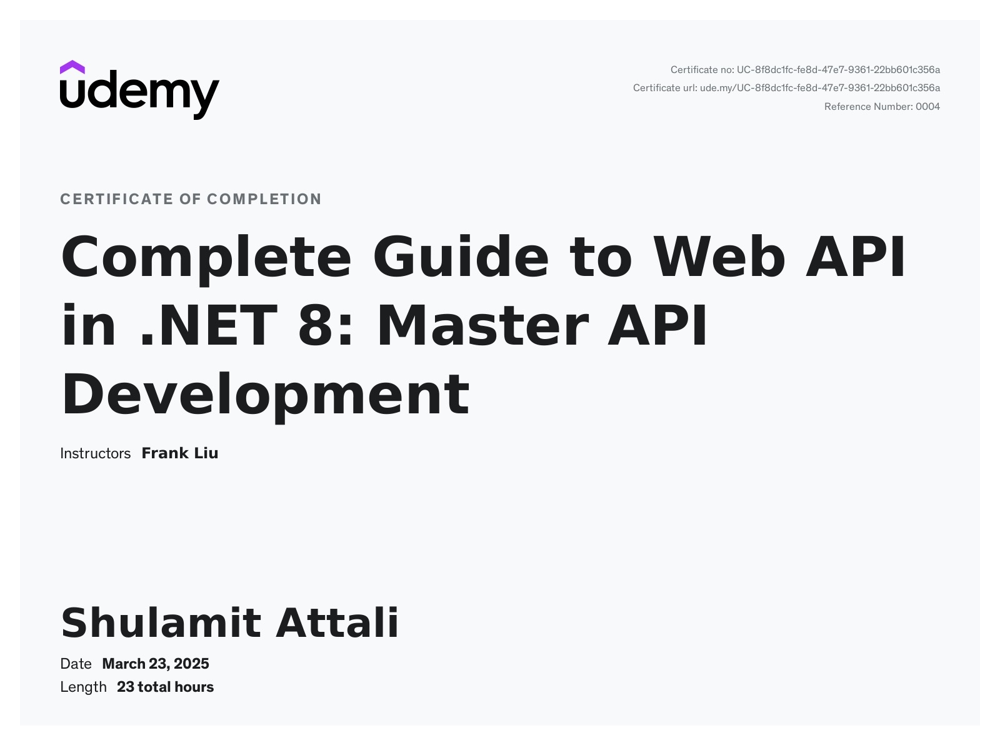

<h1 align="center">Hi, I'm Shulamit Attali 👋</h1>

  <em>Junior Backend Developer | .NET & C# Enthusiast | Lifelong Learner</em>

---

### 💼 About Me

- 🧠 Backend Developer with ~1 year of hands-on experience in .NET & C#
- 🎓 B.Sc. in Computer Science from Machon Tal, Jerusalem
- 🌱 Constantly improving through real-world projects and deep dives into system design
- 💪 Focused, curious, and committed to mastering backend technologies
  
---

### 📬 Contact Me

- 📧 Email: [shulamitna26@gmail.com](mailto:shulamitna26@gmail.com)  
- 💼 LinkedIn: [linkedin.com/in/shulamit-nahon](https://www.linkedin.com/in/shulamit-nahon/)

---

### 🧰 Languages & Tools

---

### 📜 Certificate

> **Complete Guide to Web API in .NET 8: Master API Development**  
> 🏫 Udemy | 🧑‍🏫 Frank Liu | 📆 March 23, 2025 | ⏱️ 23 Hours

---

### 🚧 Projects

> Coming soon! I'm currently building backend projects stay tuned 👀

---

### 📊 GitHub Stats

---

  <em>“Success is the sum of small efforts repeated day in and day out.”</em>

